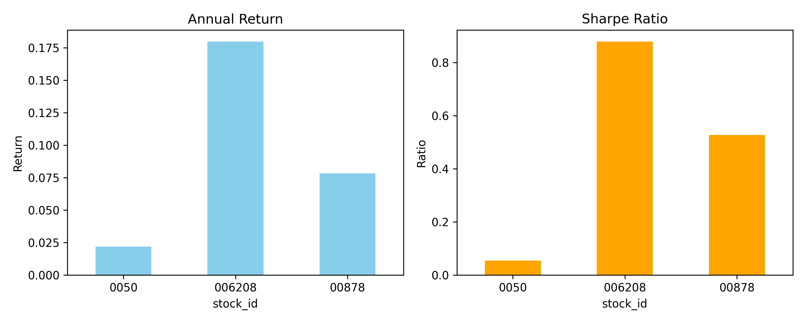
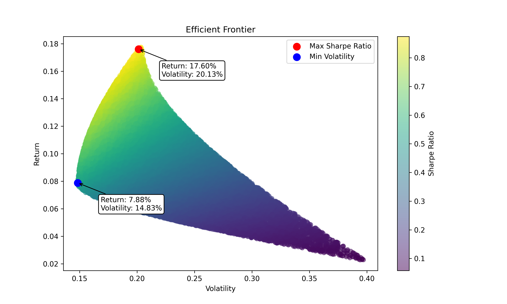

# ETF Portfolio Optimization

利用 Python 與 FinMind API 進行 ETF 投資組合最佳化分析，涵蓋資料取得、清理、績效計算與有效前緣繪製，完整呈現量化投資流程。

---

## 📌 專案簡介
本專案示範如何以台灣 ETF 為例，運用數據分析與現代投資組合理論（MPT）完成投資組合最佳化：
- 從 FinMind API 抓取歷史價格
- 清理數據並計算每日與年化績效指標
- 使用 Monte Carlo 模擬產生投資組合
- 找出最大夏普比率與最小波動率組合
- 視覺化績效與有效前緣

---

## 📂 專案結構
```
ETF_Portfolio_Optimization/
│
├── data/                # 原始與處理後數據
│   ├── etf_price_raw.csv
│   ├── etf_price_clean.csv
│   ├── etf_returns.csv
│   └── etf_performance.csv
│
├── notebooks/           # Jupyter Notebook 分析流程
│   ├── 01_get_etf_data.ipynb
│   └── 02_clean_etf_data.ipynb
│
├── scripts/             # Python 腳本
│   └── get_etf_data.py
│
├── visuals/             # 圖表輸出
│   ├── performance_chart.png
│   └── efficient_frontier.png
│
├── README.md
└── requirements.txt     # 所需套件
```

---

## 🚀 執行流程
1. **安裝套件**
   ```bash
   pip install -r requirements.txt
   ```
2. **啟動 Notebook**
   ```bash
   jupyter notebook
   ```
3. **依序執行**
   - `01_get_etf_data.ipynb`：下載 ETF 價格
   - `02_clean_etf_data.ipynb`：清理數據、計算績效、繪製圖表

---

## 📈 成果展示

### 年化報酬率與 Sharpe Ratio


### 有效前緣 (Efficient Frontier)


---

## 🛠 技術與工具
- **語言**：Python 3.x
- **資料來源**：[FinMind API](https://finmindtrade.com/)
- **套件**：pandas, numpy, matplotlib, FinMind, jupyter

---

## 🔮 後續優化
- 加入更多 ETF / 個股
- 增加其他風險指標（最大回撤、Sortino Ratio）
- 自動化每日數據更新與報告生成

---


